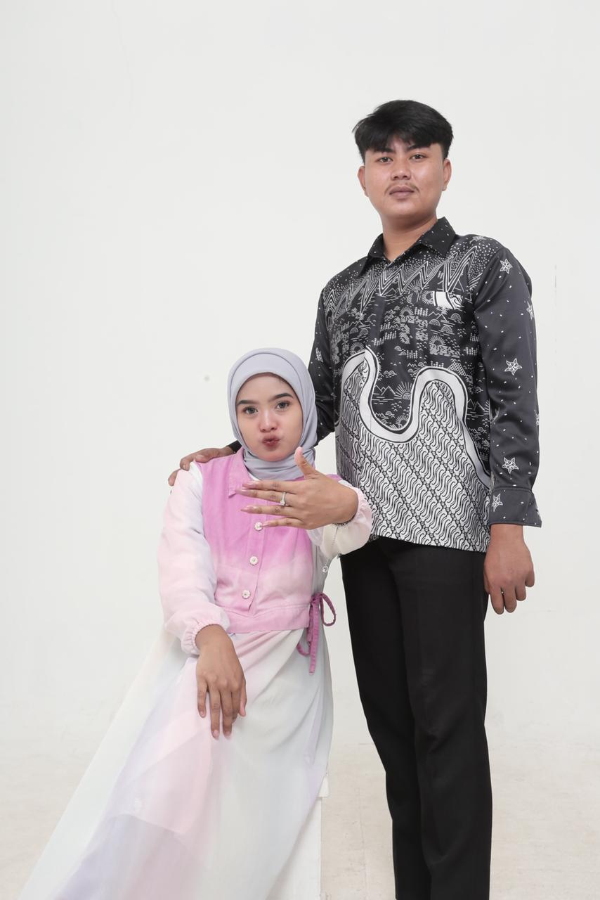
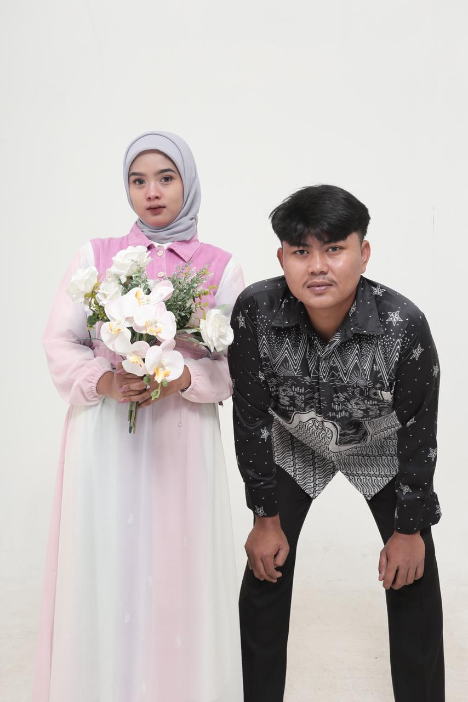

<!DOCTYPE html>
<html lang="id">
<head>
    <meta charset="UTF-8">
    <meta name="viewport" content="width=device-width, initial-scale=1.0, maximum-scale=1.0, user-scalable=no">
    <title>The Wedding of Davi & Saniah</title>
    
    
    
    <link href="https://unpkg.com/aos@2.3.1/dist/aos.css" rel="stylesheet">
    <link href="https://fonts.googleapis.com/css2?family=Dancing+Script:wght@700&family=Playfair+Display:ital,wght@0,700;1,700&family=Poppins:wght@300;400;600&display=swap" rel="stylesheet">
    
    
</head>

    <!-- NAVBAR -->
    <body class="overflow-hidden">
    

    <canvas id="particle-canvas"></canvas>

    <audio id="bgMusic" loop>
        <source src="tiara.mp3" type="audio/mpeg">
    </audio>

    

    
    
KEMBALI KE GALERI

    

    

        
🌙

        
🎵

    

    <!-- SCROLL NAV BUTTON -->
    

    
⬆

    
⬇

   

<h2 class="premium-heading">
    The Wedding Of
</h2>

    
        <!-- konten tengah -->
        

    
            

                Save The Date
            

    
            <h1 class="cover-title">
                Davi
                &
                Saniah
            </h1>
    
            

                Minggu, 31 Mei 2026
            

    
            <!-- garis -->
            

    
                

    
                

                    ✦
                

    
                

    
            

    
        

    
        <!-- BOTTOM BOX -->

    

        

            KEPADA YTH. BAPAK/IBU/SAUDARA/I
        

        <button onclick="openInvitation()"
            class="open-btn clickable-effect">

            📩
            Buka Undangan

        </button>

    

    
    

    <main id="main-content">
        <section class="bg-section">
            

            
            

                <h2 id="hero-name" class="font-wedding text-6xl md:text-8xl text-amber-500 mb-2 reveal-text">Davi & Saniah</h2>
                

                
Minggu, 31 Mei 2026

                
                <!-- NEW AESTHETIC SCROLL INDICATOR -->
                

                    

                        

                    

                    

                        
                        
                        
                    

                    
Scroll Down

                

            

        </section>

        <section class="bg-section">
            

            

                

                    <h3 class="text-3xl mb-6 text-amber-200 font-elegant italic">وَمِنْ اٰيٰتِهٖٓ اَنْ خَلَقَ لَكُمْ مِّنْ اَنْفُسِكُمْ اَزْوَاجًا لِّتَسْكُنُوْٓا اِلَيْهَا وَجَعَلَ بَيْنَكُمْ مَّوَدَّةً وَّرَحْمَةًۗ اِنَّ فِيْ ذٰلِكَ لَاٰيٰتٍ لِّقَوْمٍ يَّتَفَكَّرُوْنَ</h3>
                    

                        "Dan di antara tanda-tanda (kebesaran)-Nya ialah Dia menciptakan pasangan-pasangan untukmu dari jenismu sendiri, agar kamu cenderung dan merasa tenteram kepadanya."
                    

                    
— QS. AR-RUM: 21

                

            

        </section>

        <section class="bg-section">
            

        
            

        
                

        
                    <!-- PRIA -->
                    

        
                        

        
                            
        
                            

        
                        

        
                        <h4 class="font-wedding text-5xl text-amber-400 mt-5 mb-3">
                            Davi Setiawan
                        </h4>
        
                        

        
                        

                            Putra dari  
                            Bapak Uus Lustiawan & Ibu Nunung Nurhayati
                        

        
                    

        
                    <!-- WANITA -->
                    

        
                        

        
                            
        
                            

        
                        

        
                        <h4 class="font-wedding text-5xl text-amber-400 mt-5 mb-3">
                            Saniah Julianti
                        </h4>
        
                        

        
                        

                            Putri dari  
                            Bapak Aris & Ibu Kelly Aprillia
                        

        
                    

        
                

            

        </section>
        <section class="bg-section">
            

            

                <h2 class="font-wedding text-6xl text-amber-500 mb-10" data-aos="fade-up">Waktu Pelaksanaan</h2>
                

                    <h3 class="font-elegant text-3xl text-white mb-2">Akad & Resepsi</h3>
                    
Minggu, 31 Mei 2026 | 09.00 - Selesai

                    

                        

                    
                        

    <h3 id="days" class="text-2xl md:text-5xl font-bold text-amber-400 leading-none">
        0
    </h3>

    

        Hari
    

    <h3 id="hours" class="text-2xl md:text-5xl font-bold text-amber-400 leading-none">
        0
    </h3>

    

        Jam
    

    <h3 id="minutes" class="text-2xl md:text-5xl font-bold text-amber-400 leading-none">
        0
    </h3>

    

        Menit
    

    <h3 id="seconds" class="text-2xl md:text-5xl font-bold text-amber-400 leading-none">
        0
    </h3>

    

        Detik
    

                        </section>
                        <section class="bg-section">
                            

                            

                                <h2 class="font-wedding text-6xl text-amber-500 mb-10" data-aos="fade-up">Tempat Pelaksanaan</h2>
                                

                                    
Jl. He Sukma Kp. Bitung Ratna Rt01/02 Ds. Bitung Sari Kec. Ciawi Kab. Bogor 16720
                                    

                                    
                    

                        <iframe
                            src="https://www.google.com/maps/embed?pb=!1m18!1m12!1m3!1d3962.6974164621693!2d106.84445939999999!3d-6.684354400000001!2m3!1f0!2f0!3f0!3m2!1i1024!2i768!4f13.1!3m3!1m2!1s0x2e69c91434d38b35%3A0xc2095aecc23b1eba!2sR.A%20ALIF!5e0!3m2!1sid!2sid!4v1779476946863!5m2!1sid!2sid"
                            width="100%"
                            height="320"
                            style="border:0;"
                            allowfullscreen=""
                            loading="lazy">
                        </iframe>
                    

                    
                    

                        <a href="https://maps.app.goo.gl/QGJ4iciZ1UucqKKc8" 
                           target="_blank" 
                           class="btn-maps btn-pulse clickable-effect">
                            📍 BUKA GOOGLE MAPS
                        </a>
                    

                

            

        </section>

        <section class="bg-section">
            

        
            

                

        
                    <h2 class="font-wedding text-4xl text-amber-500 mb-8 text-center">
                        Buku Tamu
                    </h2>
        
                    <form id="rsvpForm" class="text-left space-y-4">
        
                        

                            <label class="text-xs uppercase tracking-widest text-amber-200">
                                Nama Lengkap
                            </label>
        
                            <input 
                                type="text"
                                name="nama"
                                placeholder="Masukkan nama Anda"
                                class="w-full p-3 rounded-lg bg-white/10 border border-amber-500/30 text-white outline-none focus:border-amber-500 transition-all"
                                required>
                        

        
                        

                            <label class="text-xs uppercase tracking-widest text-amber-200">
                                Konfirmasi Kehadiran
                            </label>
        
                            <select
                                id="statusKehadiran"
                                name="kehadiran"
                                class="clickable-effect w-full p-3 rounded-lg bg-black text-white border border-amber-500/30 outline-none transition-all cursor-pointer">
        
                                <option value="Hadir">
                                    Saya Akan Hadir
                                </option>
        
                                <option value="Tidak Hadir">
                                    Berhalangan Hadir
                                </option>
        
                            </select>
                        

        
                        

        
                            <label class="text-xs uppercase tracking-widest text-amber-200">
                                Jumlah Tamu
                            </label>
        
                            <select
                                name="jumlah"
                                class="clickable-effect w-full p-3 rounded-lg bg-black text-white border border-amber-500/30 outline-none cursor-pointer">
        
                                <option value="1">1 Orang</option>
                                <option value="2">2 Orang</option>
                                <option value="3">3 Orang</option>
                                <option value="4">4 Orang</option>
        
                            </select>
        
                        

        
                        

        
                            <label class="text-xs uppercase tracking-widest text-amber-200">
                                Ucapan & Doa
                            </label>
        
                            <textarea
                                name="ucapan"
                                placeholder="Tuliskan pesan manis Anda..."
                                class="w-full p-3 rounded-lg bg-white/10 border border-amber-500/30 text-white outline-none focus:border-amber-500 transition-all"
                                rows="3"></textarea>
        
                        

                      

                        kirim wa ke :
                    

                        <!-- BUTTON WA DAVI -->
                        <button
                            type="button"
                            onclick="sendWA('davi')"
                            class="clickable-effect w-full bg-amber-600 py-3 rounded-xl font-bold text-white shadow-lg hover:bg-amber-500 transition-all cursor-pointer">
        
                            Davi Setiawan
        
                        </button>
        
                        <!-- BUTTON WA SANIAH -->
                        <button
                            type="button"
                            onclick="sendWA('saniah')"
                            class="clickable-effect w-full bg-pink-600 py-3 rounded-xl font-bold text-white shadow-lg hover:bg-pink-500 transition-all cursor-pointer">
        
                            Saniah Julianti
        
                        </button>
        
                    </form>
                

            

        </section>

        <section class="bg-section">
            

        
            

                <h2 class="font-wedding text-5xl md:text-6xl text-amber-400 mb-14"
                    data-aos="fade-up">
                    Wedding Gift
                </h2>
        
                

        
                    <!-- CARD BCA 1 -->
                    

                        
💳

        
                        <h3 class="bank-name">BANK BCA</h3>
        
                        

                            6821846801
                        

        
                        

                            a/n Davi Setiawan
                        

        
                        <button
                            onclick="copyToClipboard('6821846801', this)"
                            class="gift-btn clickable-effect">
                            SALIN NOMOR
                        </button>
                    

        
                    <!-- CARD BCA 2 -->
                    

                        
💳

        
                        <h3 class="bank-name">BANK BCA</h3>
        
                        

                            6821989393
                        

        
                        

                            a/n Saniah Julianti
                        

        
                        <button
                            onclick="copyToClipboard('6821989393', this)"
                            class="gift-btn clickable-effect">
                            SALIN NOMOR
                        </button>
                    

        
                    <!-- ALAMAT -->
                    

        
                        
📍

        
                        <h3 class="bank-name">
                            LOKASI AKAD
                        </h3>
        
                        

                            Jl. He Sukma Kp. Bitung Ratna RT01/02
                            Ds. Bitung Sari Kec. Ciawi
                            Kab. Bogor 16720
                        

    
                        <button
                            onclick="copyToClipboard('Jl. He Sukma Kp. Bitung Ratna RT01/02 Ds. Bitung Sari Kec. Ciawi Kab. Bogor 16720', this)"
                            class="gift-btn clickable-effect">
                            SALIN ALAMAT
                        </button>

                    

        
                

            

        </section>

        <section class="bg-section overflow-hidden">
            

            

                <h2 class="font-wedding text-5xl text-amber-500 mb-20" data-aos="fade-up">Our Moments</h2>
                

                    

                        

                            

                            

                            

                            

                        

                    

                

                
Bukan tentang seberapa lama bersama, tapi seberapa berarti setiap momennya #MeggahNyaPernikahan

            

        </section>
        <!-- DOA PENGANTIN -->
<section class="bg-section">
    

    

        

            <h2 class="font-wedding text-5xl md:text-6xl text-amber-400 mb-6">
                Doa Pengantin
            </h2>

            

            

                بَارَكَ اللّٰهُ لَكَ وَبَارَكَ عَلَيْكَ وَجَمَعَ بَيْنَكُمَا فِيْ خَيْرٍ
            

            

                "Semoga Allah memberkahimu ketika bahagia dan ketika susah,
                serta mengumpulkan kalian berdua dalam kebaikan."
            

            

                HR. Abu Dawud & Tirmidzi
            

            

                Menjadi sebuah kebahagiaan bagi kami apabila
                Bapak/Ibu/Saudara/i berkenan hadir dan memberikan doa restu
                untuk pernikahan kami.
            

        

<!-- CREDIT -->
<section class="credit-section">

    

        <!-- DESIGNER (tanpa box) -->
        

            Design By
            FRN
        

        

        <!-- INSTAGRAM (tetap pakai box) -->
        <a href="https://instagram.com/frhan29_"
           target="_blank"
           class="credit-instagram">

            

                🅾
            

            

                
                    Instagram
                

                
                    @frhan29_
                

            

        </a>

    

</section>

    </main>

    
    
